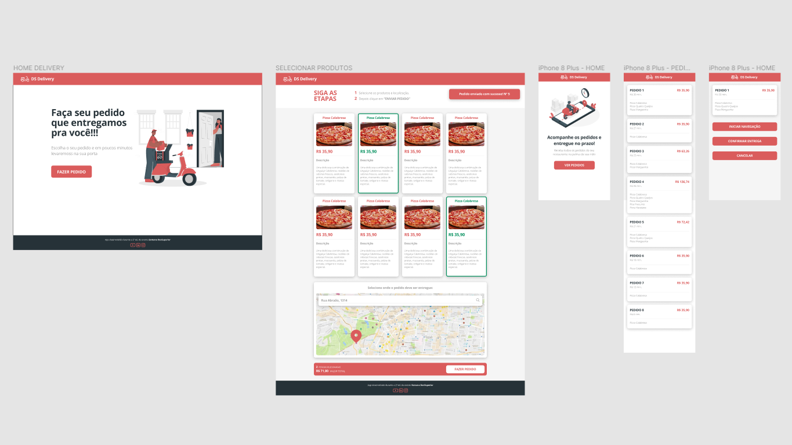
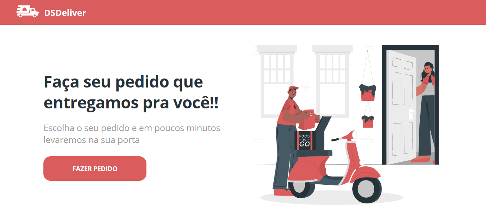
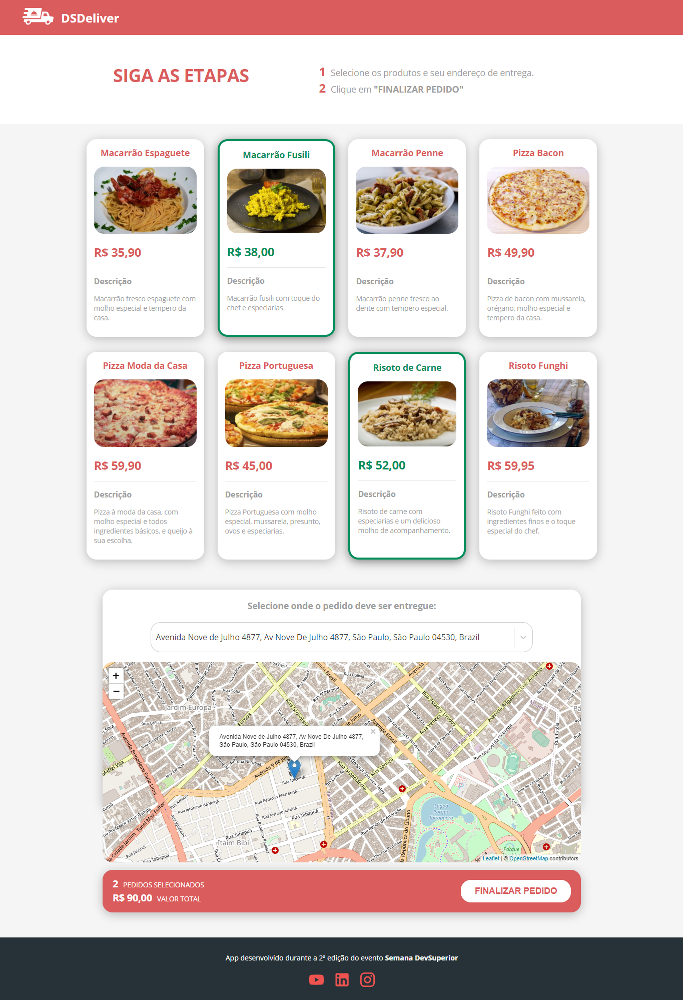

<h2 align="center">
   DSDeliver - Semana DevSuperior 2.0
</h2>

https://github.com/KarinaRovani/dsdeliver-sds2/assets/37753278/5691ce68-3768-4506-a601-311f59bd9537

# About
The application consists of the management of special dishes of Brazilian cuisine and provides a fast, practical and safe system for the delivery of your favorite meal. This application can record orders made by restaurant customers and organizes deliveries to the addresses provided.

Project DevSuperior 2.0

<!-- You can see this application working in real time over here: https://sds2-karinarovani.netlify.app/
- It can take a minute to reconnect to Heroku and show up all the dishes due to Heroku server downtime. Please wait a little bit after openning the application
-->

# Features
- Product listing via API (backend), hosted on Heroku
- Selection of order items
- Address search through an interactive and dynamic map
- Validation and completion of orders
- responsive layout
- Custom 404 error page for non-existent routes
- Loading indicator when loading product data by heroku

## Technologies used
- STS (Spring Tool Suite)
- PostMan
- PostgreSQL 12
- PgAdmin
## Back end
- Java
- Spring Boot
- JPA / Hibernate
- Maven
- JDK
## Front end
- HTML / CSS / JS / TypeScript
- ReactJS
- React Native
- Apex Charts
- Expo
## Deployment in production
- Back end: Heroku
- Front end web: Netlify
- Database: Postgresql

## Layout
<figure>

  
  <figcaption>Application screen layout</figcaption>

</figure>
 
<figure>

  
  <figcaption>Home Page</figcaption>

</figure>
 
<figure>

  
  <figcaption>Order page</figcaption>

</figure>
 

<h5 align="center">
  &copy;2021 - <a href="https://github.com/KarinaRovani/">Karina de Oliveira Rovani</a>
</h5>

